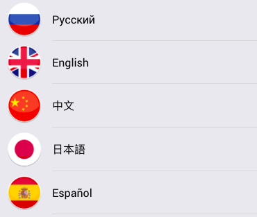

# react-native-round-flags
Fun with flags (in React Native)!

### Example


### Usage
```javascript
import Flag from 'react-native-round-flags';

const JustAFlag = () =>
  <Flag code="DE"/>
```

### Props  
#### code  
#### Type: `String`  
The ISO code of a flag, for example "DE", "FR" or "GB"

#### style (optional)  
Allows additional styles to be passed through.

### License
MIT
